<picture>
  <source media="(prefers-color-scheme: dark)" srcset="./dark.svg">
  <source media="(prefers-color-scheme: light)" srcset="./light.svg">
  
</picture>

  

Full-stack developer crafting clean, scalable software with **PHP, C#, JavaScript &amp; SQL**.
CSE student at AIUB — currently deepening my full-stack &amp; software-engineering practice.

 

## 🚀 Featured Projects

| Project | Description | Stack |
|---|---|---|
| **[Bazar Hisab](https://github.com/UdayDey-Boss/Bazar-Hisab)** | Smart shopping & expense tracker | PHP |
| **Library Management System** | End-to-end library catalog & lending workflow | PHP, MySQL |

 

## 🛠️ Tech Stack

 

Thanks for stopping by — feel free to explore my pinned repositories below ⬇️

